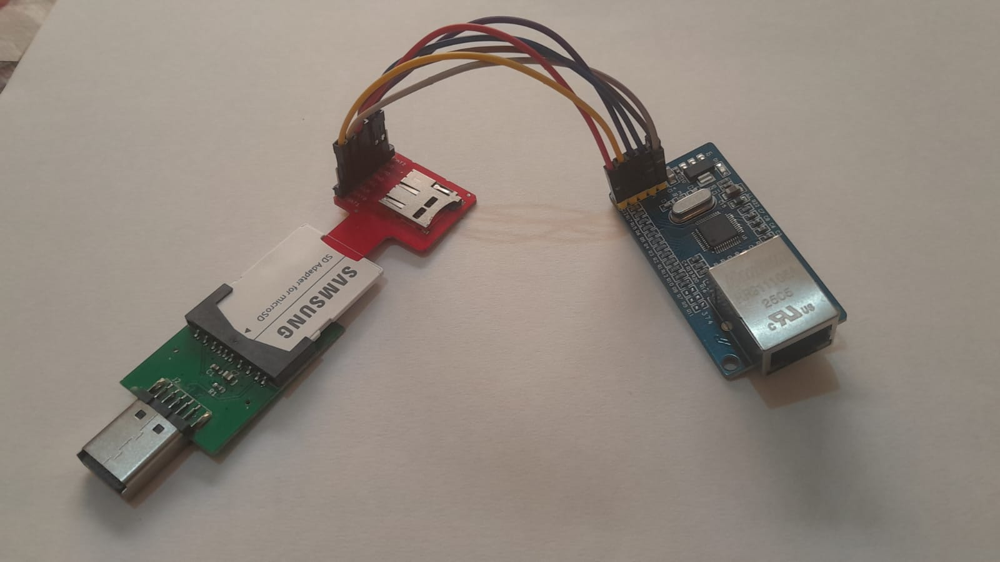

# WIZnet W5500 Ethernet for Sega Dreamcast

### About

These are hardware schemes based on the [WIZnet W5500 Ethernet Adapter by SWAT](http://www.dc-swat.ru/blog/hardware/1147.html) for Dreamcast.

### Components

For the SCIF serial port:

- [DC SD Adapter V2](https://s.click.aliexpress.com/e/_c3AjvPdd) or a [Coders Cable](https://dreamcast.wiki/Coder's_cable);
- [W5500 Ethernet Adapter](https://s.click.aliexpress.com/e/_c4poacBl) or a [Lite W5500 Ethernet Adapter](https://s.click.aliexpress.com/e/_c37pLoLz);
- [SD Adapter for MicroSD](https://s.click.aliexpress.com/e/_c3gHQMOF) (Optional: if you don't want to soldering and it will connect in the SD port of the DC SD Adapter)
- [Micro SD Sniffer](https://s.click.aliexpress.com/e/_c4KTzam7) (Optional: if you want to use with the SD Adapter for MicroSD or directly on the Micro SD port of the DC SD Adapter)
- [Dupont cables female to female](https://s.click.aliexpress.com/e/_c3PJ8LpV) (Optional: if you don't want or don't know how to soldering)

<!-- TODO For the SCI interface: -->

Also you will need a [DreamShell](https://github.com/DC-SWAT/DreamShell) or homebrew build with W5500 drivers to use it.

### Schemes

| DC SD Adapter V2 (pin) | SD Adapter for MicroSD + SD Sniffer | W5500 (Blue model) |
| ---------------------- | ----------------------------------- | ------------------ |
| GND (3)                | GND                                 | GND                |
| RX (4)                 | DAT0                                | MISO               |
| TX (5)                 | CMD                                 | MOSI               |
| RTS (6)                | CD                                  | SCS                |
| CTS (7)                | CLK                                 | SCLK               |
| 3.3V (10)              | VCC                                 | 3.3V               |

You can test if it's working on Dreamshell by checking the options **Connect Ethernet**, **Start FTP Server** and **Start HTTP Server** on the **Network** section of a **DreamShell** build that supports it.

